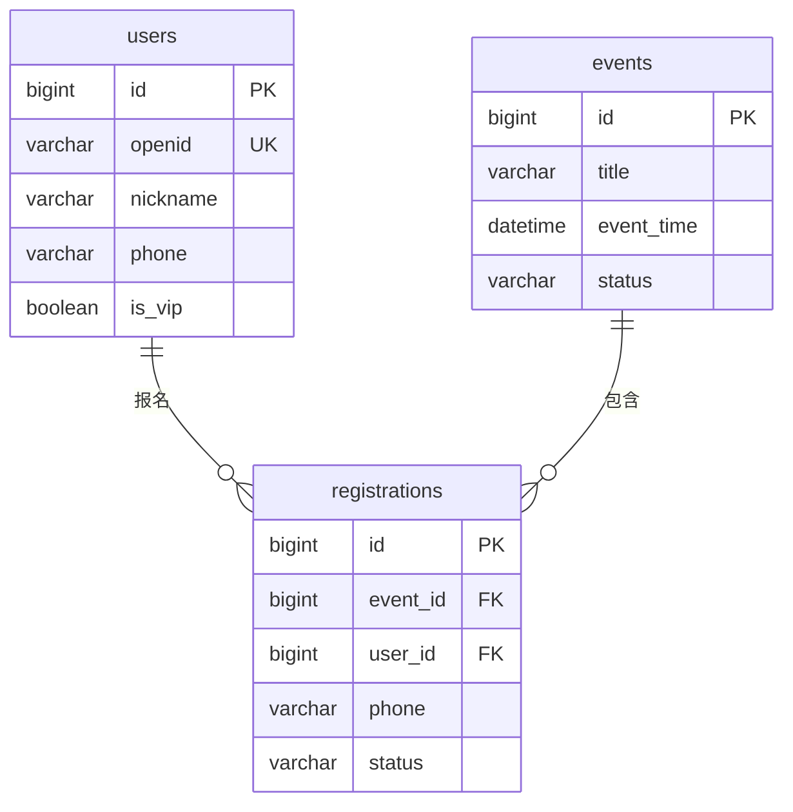

# 数据库表结构

本文档记录当前 MVP 后端的实际数据库结构。字段定义以
`backend/app/models.py` 为准，业务规则以当前 Flask 接口实现为准。

## 1. 数据库约定

- 正式环境：MySQL。
- 本地测试：SQLite。
- MySQL 主键使用 `BIGINT` 自增；SQLite 测试环境映射为 `INTEGER`。
- 时间字段使用服务端本地时间，当前部署时区为 `Asia/Shanghai`。
- 用户与报名记录采用软删除/匿名化策略，不依赖级联删除。

## 2. 表关系



`settings` 和 `admin_audits` 是独立业务表，不参与外键关系。

## 3. users 用户表

用途：保存通过微信 OpenID 登录的小程序用户。

| 字段 | 类型 | 约束/默认值 | 说明 |
| --- | --- | --- | --- |
| `id` | BIGINT | 主键，自增 | 系统内部用户 ID |
| `openid` | VARCHAR(64) | 非空，唯一，索引 | 微信用户唯一标识 |
| `nickname` | VARCHAR(80) | 非空，默认“微信用户” | 用户昵称 |
| `avatar_url` | VARCHAR(500) | 非空，默认空字符串 | 微信云文件地址或默认头像标识 |
| `phone` | VARCHAR(32) | 可空 | 用户最近一次报名所填手机号；当前不唯一且不作为登录凭证 |
| `is_vip` | BOOLEAN | 非空，默认 `false` | VIP 标记 |
| `privacy_version` | VARCHAR(32) | 可空 | 用户同意的隐私政策版本 |
| `privacy_consent_at` | DATETIME | 可空 | 隐私政策同意时间；当前也用于判断是否已完成注册 |
| `created_at` | DATETIME | 非空，自动生成 | 创建时间 |
| `updated_at` | DATETIME | 非空，自动更新 | 最后更新时间 |
| `deleted_at` | DATETIME | 可空 | 账号注销时间；非空表示已注销 |

关键规则：

- `openid` 是当前账号唯一键，一个微信用户只能对应一个有效账号。
- 手机号由用户在报名时手动填写，未经短信或微信能力验证，因此不设置唯一约束。
- 注销时会清空手机号、头像并替换昵称和 OpenID，保留匿名化后的业务记录。

## 4. events 活动表

用途：保存小程序展示和 Admin 管理的活动。

| 字段 | 类型 | 约束/默认值 | 说明 |
| --- | --- | --- | --- |
| `id` | BIGINT | 主键，自增 | 活动 ID |
| `title` | VARCHAR(160) | 非空 | 活动标题 |
| `subtitle` | VARCHAR(255) | 非空，默认空字符串 | 副标题 |
| `cover_image` | VARCHAR(500) | 非空，默认空字符串 | 封面图片地址 |
| `cover_color` | VARCHAR(32) | 非空，默认 `#d8d1ff` | 无图片时的主题色 |
| `event_time` | DATETIME | 非空 | 活动实际开始时间 |
| `event_time_text` | VARCHAR(80) | 非空 | 面向用户的展示时间文案 |
| `location` | VARCHAR(255) | 非空 | 地点或线上方式 |
| `price_text` | VARCHAR(80) | 非空，默认“免费” | 展示价格文案 |
| `description` | TEXT | 非空 | 活动介绍 |
| `target_audience` | TEXT | 非空 | 适合人群 |
| `flow` | TEXT | 非空 | 活动流程 |
| `notice` | TEXT | 非空 | 注意事项 |
| `category` | VARCHAR(40) | 非空，默认“本周”，索引 | 活动分类 |
| `capacity` | INTEGER | 可空 | 名额；空值表示不限 |
| `registration_deadline` | DATETIME | 可空 | 报名截止时间 |
| `status` | VARCHAR(20) | 非空，默认 `online`，索引 | 发布状态 |
| `is_featured` | BOOLEAN | 非空，默认 `false` | 是否首页主推 |
| `created_at` | DATETIME | 非空，自动生成 | 创建时间 |
| `updated_at` | DATETIME | 非空，自动更新 | 最后更新时间 |

`status` 当前取值：

| 值 | 含义 |
| --- | --- |
| `online` | 已上架，小程序可见并允许报名 |
| `offline` | 未上架/已下架，小程序不可见 |

名额计算包含状态为 `registered` 和 `checked_in` 的报名，不包含已取消报名。

## 5. registrations 报名表

用途：保存用户对活动的报名、取消和签到记录。

| 字段 | 类型 | 约束/默认值 | 说明 |
| --- | --- | --- | --- |
| `id` | BIGINT | 主键，自增 | 报名记录 ID |
| `event_id` | BIGINT | 非空，外键，索引 | 关联 `events.id` |
| `user_id` | BIGINT | 非空，外键，索引 | 关联 `users.id` |
| `name` | VARCHAR(80) | 非空 | 本次报名填写的联系人姓名 |
| `phone` | VARCHAR(32) | 非空 | 本次报名填写的手机号 |
| `remark` | VARCHAR(500) | 非空，默认空字符串 | 非健康敏感备注 |
| `status` | VARCHAR(20) | 非空，默认 `registered`，索引 | 报名状态 |
| `checked_in_at` | DATETIME | 可空 | 签到时间 |
| `cancelled_at` | DATETIME | 可空 | 取消时间 |
| `created_at` | DATETIME | 非空，自动生成 | 首次创建时间 |
| `updated_at` | DATETIME | 非空，自动更新 | 最后更新时间 |

外键删除策略均为 `RESTRICT`，避免误删活动或用户后造成孤立报名记录。

唯一约束：

```text
UNIQUE(event_id, user_id)
```

因此同一用户对同一活动只有一条报名记录。取消后再次报名会复用并更新原记录，
不会新增第二条记录。

`status` 当前取值：

| 值 | 含义 |
| --- | --- |
| `registered` | 已报名，待签到 |
| `checked_in` | 已签到 |
| `cancelled` | 已取消 |

## 6. settings 配置表

用途：保存首页和平台级可配置内容。

| 字段 | 类型 | 约束/默认值 | 说明 |
| --- | --- | --- | --- |
| `key` | VARCHAR(80) | 主键 | 配置键 |
| `value` | TEXT | 非空 | 配置值，复杂结构以 JSON 字符串保存 |
| `updated_at` | DATETIME | 非空，自动更新 | 最后更新时间 |

当前种子配置：

| Key | 内容 |
| --- | --- |
| `platform_name` | 平台名称 |
| `platform_slogan` | 平台标语 |
| `service_cards` | 首页服务标签 JSON 数组 |

## 7. admin_audits 管理操作审计表

用途：记录 Admin 后台关键修改操作。

| 字段 | 类型 | 约束/默认值 | 说明 |
| --- | --- | --- | --- |
| `id` | BIGINT | 主键，自增 | 审计记录 ID |
| `action` | VARCHAR(120) | 非空 | 操作类型 |
| `target_type` | VARCHAR(80) | 非空 | 目标类型，如 `event`、`user` |
| `target_id` | VARCHAR(80) | 非空 | 目标 ID，统一保存为字符串 |
| `detail` | TEXT | 非空，默认空字符串 | 操作详情 |
| `created_at` | DATETIME | 非空，自动生成 | 操作时间 |

当前常见 `action`：

- `create_event`
- `update_event`
- `toggle_event`
- `checkin`
- `toggle_vip`
- `bulk_set_vip`

当前 MVP 尚未建立管理员账号表，管理员身份来自环境变量和服务端 Session，
因此审计表暂未保存 `admin_user_id`。正式多管理员版本应补充管理员表及操作者字段。

## 8. 当前 MVP 数据规则

- 账号唯一性：按微信 `openid` 唯一。
- 手机号唯一性：不限制。当前手机号未经验证，不能作为可靠账号键。
- 活动报名唯一性：同一 `user_id` + `event_id` 唯一。
- VIP：由 Admin 单个或批量设置。
- 活动删除：当前不提供物理删除，只支持上下架。
- 用户注销：匿名化用户资料和报名联系信息，保留业务记录。
- 报名备注：仅允许一般活动备注，不应填写疾病诊断、病史等健康敏感信息。

## 9. 后续演进建议

正式运营阶段可按需要增加：

- `admin_users`：管理员账号、密码哈希、角色和状态。
- `admin_audits.admin_user_id`：记录实际操作者。
- `verified_phone` / `phone_verified_at`：接入短信或微信手机号验证后保存已验证号码。
- 已验证手机号唯一索引：只对完成验证的号码建立唯一规则。
- 正式迁移工具：使用 Alembic 取代当前轻量运行时字段补丁。
